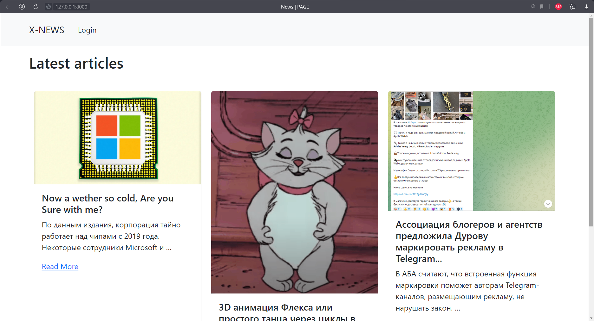
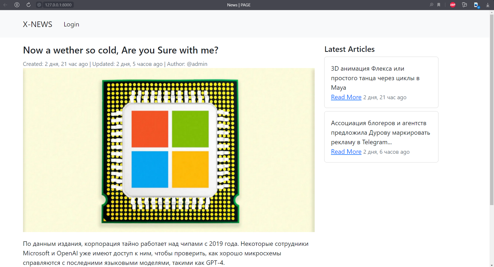
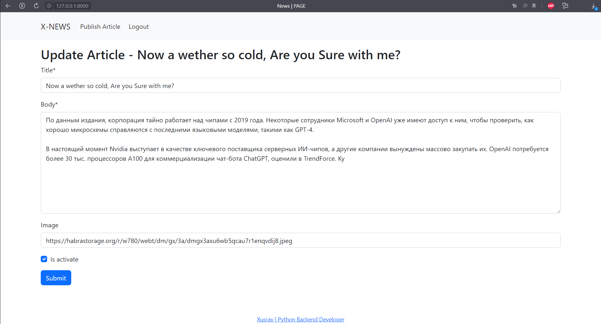
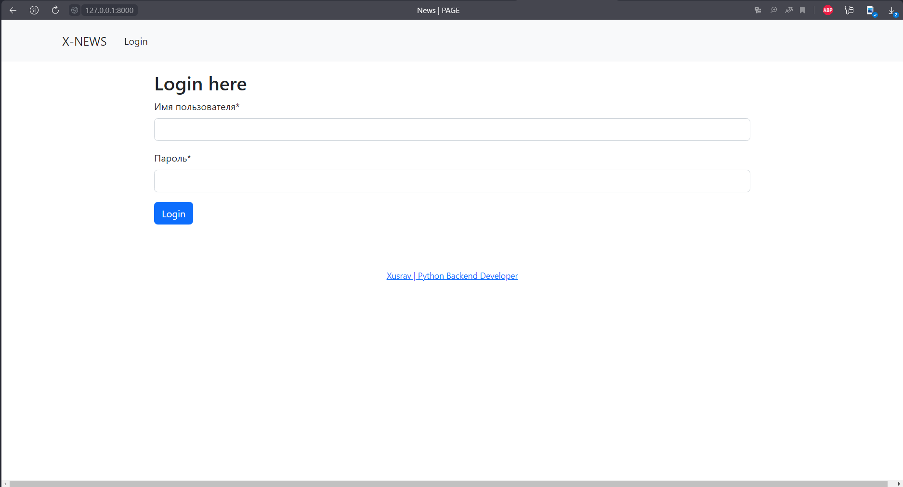

# Django News App

This is a news application built using the Django web framework. It allows users to create, read, update, and delete
news articles. Users can also view a list of all active articles.

## Installation

1. Clone the repository: `git clone https://github.com/xusraw1/django-news-app.git`
2. Change into the project directory: `cd news-project`
3. Enter a virtual environment: `pipenv shell`
4. Migrate the database: `python manage.py migrate`
5. Create a superuser: `python manage.py createsuperuser`
6. Run the development server: `python manage.py runserver`
7. Open your web browser and navigate to http://127.0.0.1:8000/.

## Usage
Creating Articles
To create a new article, click on the "Create Article" link on the home page. You will be asked to enter the article's title, body, and image URL. You can also choose whether to activate the article or not. Click on the "Create" button to create the article.

## Updating Articles
To update an existing article, click on the article's title on the home page. On the article detail page, click on the "Update" link. You will be taken to a form where you can update the article's title, body, and image URL. You can also activate or deactivate the article. Click on the "Update" button to save your changes.

## Deleting Articles
To delete an article, click on the article's title on the home page. On the article detail page, click on the "Delete" link. You will be asked to confirm that you want to delete the article. Click on the "Delete" button to delete the article.

## Viewing Articles
To view all active articles, click on the "Read more" link on the top navigation menu.

## Contributing
Contributions are welcome! If you find a bug or would like to add a new feature, please open an issue or submit a pull request.

## Photo
HOME PAGE

ARTICLE PAGE 

UPDATE PAGE

LOGIN PAGE

# Thanks for watching ❤️